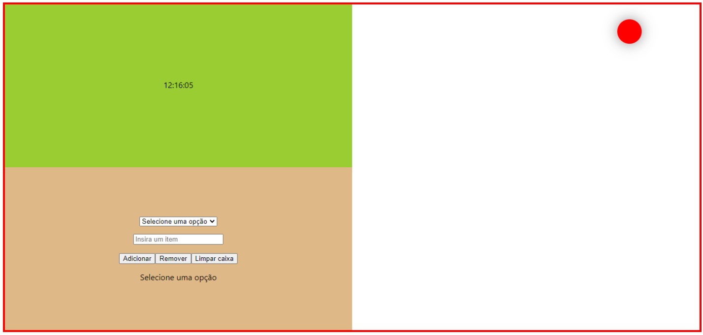
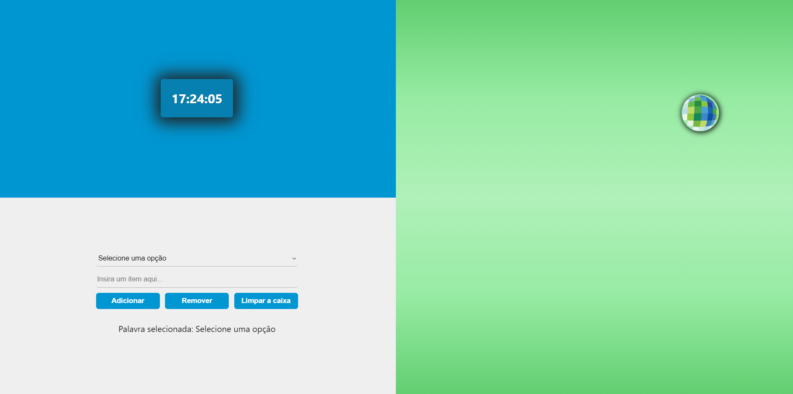

# Geopixel - Teste para vaga de Estágio de Desenvolvimento

Este teste foi desenvolvido em ReactJS para o processo seletivo de Estágio em Desenvolvimento da empresa Geopixel. Foram propostos três desafios pela empresa, onde cada um dos desafios serviu para julgar competências diferentes em minha stack:

* Relógio: Com uma dificuldade considerada fácil, este problema julgou minha capacidade de manipulação e administração de estados simples
* Seletor de itens: Em um nível moderado de dificuldade, julgou minha capacidade de controlar estados compartilhados, eventos e o relacionamento entre componentes da interface.
* Bola tímida: Neste desafio de conhecimentos mais específicos, julgou minha capacidade de controlar eventos específicos e como alterar estilos CSS dinamicamente.

## Resultados esperados pela empresa

A aplicação deverá ser uma página web simples, dividida em três partes, onde cada parte deverá estar cada um dos desafios a serem realizados. Ao final, a página web deverá estar similar a algo como na imagem abaixo:

## Resultados do teste

Após desenvolvimento do que foi proposto pelos desafios, o teste teve o seguinte resultado:

# Acesse o resultado projeto on-line

Caso tenha preferência, não é necessário instalar o projeto em sua máquina local. Você poderá acessá-lo através do seguinte link:

https://leandroteixeira97.github.io/teste-geopixel/

# Download e instalação do projeto local

Para rodar o projeto em uma máquina local você precisará, primeiramente, do Node instalado em seu computador https://nodejs.org/en/ . Após isto, siga os passos:

## Passo I
Realizar o seguinte comando no bash do git:

`git clone https://github.com/leandroteixeira97/miniblog-reactjs.git`

Isto realizará uma cópia local do repositório em sua máquina.

## Passo II
No diretório do projeto, dê o seguinte comando no bash para instalar todas as dependências necessárias do projeto:

 `npm install`

## Passo III
Ainda no diretório, dê o seguinte comando no bash para rodar o projeto localmente, em modo de desenvolvimento.

`npm start`

## Passo IV
Abra o link [http://localhost:3000](http://localhost:3000) para visualizar o projeto rodando em um servidor local.